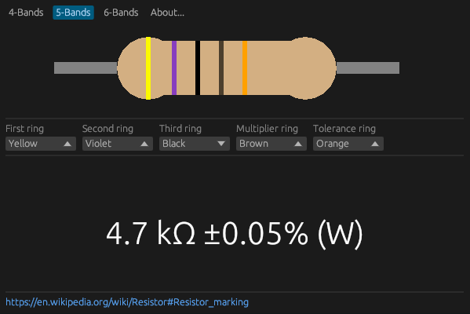

## Resistor
Resistor color code calculator written in Rust using [egui](https://www.egui.rs/) and [macroquad](https://macroquad.rs/) libraries.

It can be compiled in [WebAssembly](https://en.wikipedia.org/wiki/WebAssembly) format and run from the web browser directly on any platform.

## Screenshot

## Demo
[Resistor color code calculator](https://games.os.vc/webgames/resistor/)

## License
Resistor color code calculator is free and open-source software released under the MIT License.
