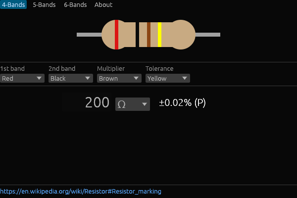

## Resistor

Resistor color code calculator written in Rust using [eframe/egui](https://www.egui.rs/).

Supports 4-band, 5-band, and 6-band resistors with bidirectional calculation — select color bands to see the resistance value, or enter a resistance value to see the corresponding color bands.

### Features

- 4-band, 5-band, and 6-band resistor modes
- Visual resistor rendering with color-coded bands
- Reverse calculation: type a resistance value to determine band colors
- Unit selector (Ω, kΩ, MΩ, GΩ)
- Tolerance and temperature coefficient support
- Persistent configuration (window position, selected bands, and mode are saved between sessions)

### Screenshot



### Building

```sh
cargo build --release
```

### Configuration

Settings are stored in `~/.config/resistor/config.json` and are saved automatically when the application is closed.

### License

Resistor color code calculator is free and open-source software released under the MIT License.
